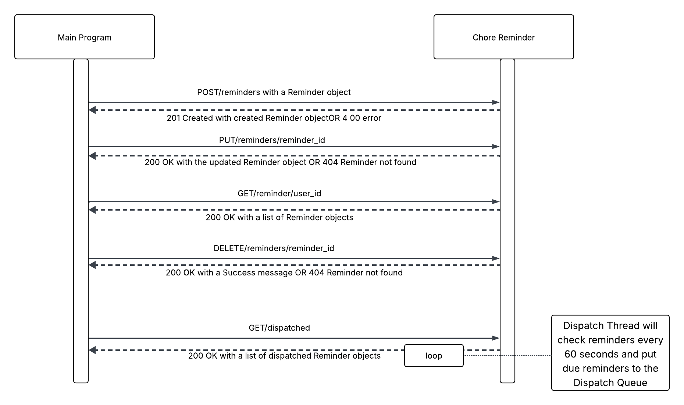

This microservice provides a RESTful API to manage and dispatch chore reminders.

How to Run the Microservice
To get this microservice up and running, follow these steps:
	1. Prerequisites: Ensure you have Python installed on your system. 
	2. Install dependencies: Open your terminal or command prompt, and with your virtual environment activated, install all the required packages from your requirements.txt file using pip:
		pip install -r requirements.txt
	3. Run the application: Save the provided code as a Python file (e.g., chore_reminder.py). In your terminal, navigate to the directory where you saved the file.
		a. The code includes the line app.run(debug=True, port=5001), which means the application will run on port 5001 by default. You can change this port number by modifying the port value in that line.
		b. To run the application, execute the following command:
			python chore_reminder.py

A. how to programmatically REQUEST data 

The microservice provides a RESTful API for managing chore reminders. You can interact with it using standard HTTP requests.

	1. Creating a new reminder
	To create a new reminder, send a POST request to the /reminders endpoint with a JSON payload.
	Example Call:
		url = "http://localhost:5001/reminders"  # Update with the correct URL if necessary

		payload = {
			"chore_name": "Take out the trash",
			"user_id": "user123",
			"due_date": "2025-08-04T10:00:00",
			"remind_offset_minutes": 60
		}
		# This line sends the request	
		response = requests.post(url, json=payload)
		# The following lines demonstrate receiving and handling the response
		print(response.status_code)
		print(response.json())

	2. Getting all reminders for a user
	To retrieve all reminders for a specific user, send a GET request to the /reminders/<user_id> endpoint.
	Example Call:
		user_id = "user123"
		url = f"http://localhost:5001/reminders/{user_id}"
		# This line sends the request
		response = requests.get(url)
		# The following lines demonstrate receiving and handling the response
		print(response.status_code)
		print(response.json())

	 3. Updating an existing reminder
	 To update an existing reminder, send a PUT request to the /reminders/<reminder_id> endpoint with a JSON payload containing the fields you wish to update.
	 Example Call:
		reminder_id = "reminder123"  # Use a valid reminder_id
		url = f"http://localhost:5001/reminders/{reminder_id}"

		payload = {
			"chore_name": "Take out the trash and recycling",
			"due_date": "2025-08-05T12:00:00",
			"remind_offset_minutes": 120
		}
		# This line sends the request
		response = requests.put(url, json=payload)
		# The following lines demonstrate receiving and handling the response
		print(response.status_code)
		print(response.json())

	 4. Deleting a reminder
	 To delete a reminder, send a DELETE request to the /reminders/<reminder_id> endpoint.
		reminder_id = "reminder123"  # Use a valid reminder_id
		url = f"http://localhost:5001/reminders/{reminder_id}"
		# This line sends the request
		response = requests.delete(url)
		# The following lines demonstrate receiving and handling the response
		print(response.status_code)
		print(response.json())

B. how to programmatically RECEIVE data

This section demonstrates how to explicitly retrieve information from the microservice. While all requests receive a response, this section focuses specifically on the endpoint designed for polling data that has been dispatched by the server.

	1. Getting dispatched reminders
	To receive reminders that have become due, send a GET request to the /dispatched endpoint. The server will return a list of all reminders that have been dispatched since the last time this endpoint was called.
	Example Call:
		url = "http://localhost:5001/dispatched"

		# This line sends the request to retrieve dispatched data
		response = requests.get(url)

		# The following lines demonstrate receiving and handling the response
		print(response.status_code)
		print(response.json())

UML diagram

